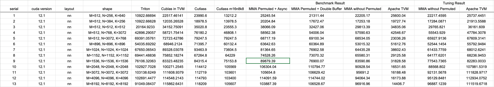

# MMA Auto Tensorization with Permuted Layout benchmark result

Please refer to this PR: https://github.com/apache/tvm/pull/14673

## Benchmark result

See: https://docs.google.com/spreadsheets/d/1thf1jsbX87WokRfESXO14fx40H3vYHDk6EWkb_wnv5Y

In the following table, we use fp16 as accumulator. Apache TVM shows great performance gap between what tuning log reports and what we get from benchmark script, so we kept both of them for reference.




## Run tuning and benchmarking on your machine

Just run

```python
python3 gemm_rune_all.py
```

You could comment some task out in `gemm_rune_all.py` to run a subset of tasks.